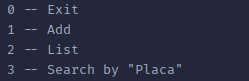
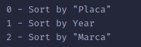

## Trabalho 2 - Árvores binárias de busca

Considere uma lista de carros, onde cada carro possui os seguintes campos: placa, marca e ano. Crie um programa com os seguintes requisitos:

  - [X]  A lista deve ser ordenada fisicamente pela placa dos carros.

- [X]  Deve ser possivel incluir e excluir carros na lista.

- [X]    Deve ser mantida em memória uma árvore binária relativa à placa dos carros.

- [X]    Deve ser mantida em memória uma árvore binária cujo percurso seja equivalente à lista ordenada pelo marca.

- [X]    Deve ser mantida em memória uma árvore binária cujo percurso seja equivalente à lista ordenada pela ano.

- [X]    Deve ser possível buscar carros pela placa, usando a árvore binária auxiliar.

- [X]    Deve ser possivel listar os carros ordenadamente pela placa, percorrendo a lista.

- [X]    Deve ser possivel listar os carros ordenadamente pelo marca, através da árvore auxiliar.

- [X]    Deve ser possivel listar os carros ordenadamente pela ano, através da árvore auxiliar.

A ‘interface’ é simples, não necessita explicações. Mas...

Menu:  

2 -- List:  

3 -- Search (deletar está em Search):  
